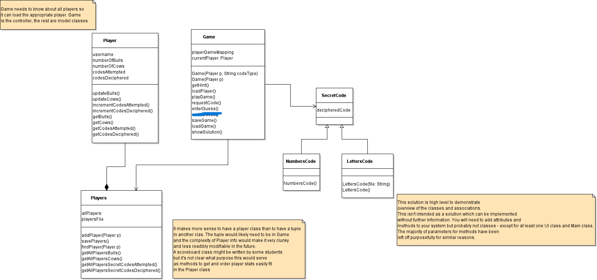

# CS207 - Advanced Programming
## Bulls and Cows Project
### Authors: Fraser Watt, Alexe Boyd, Ross Paton, Jacob Mwangu, Finlay Colston

### Summary:
Bulls and Cows is a code breaking game.
Aim of the game is to decipher secret codes by trial and error.
Code can be either a word or number.
Words are English words, and the numbers are all unique (1232 is invalid).
For each guess, the number of matches will be given, split into bulls and cows.
A cow matches in the wrong position, a bull matches in the correct position.

### Example:
- Code: 1359
- User guess: 1395

- Matches: 2 bulls and 2 cows (Bulls: 1, 3 Cows: 9, 5)

### Additional Notes:
- Codes were changed to be of length 8 at the end of sprint 2
- Read assignment document for more information on the project